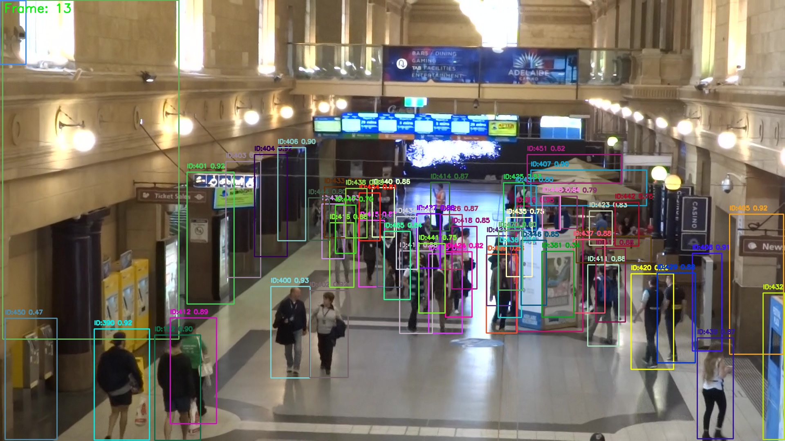
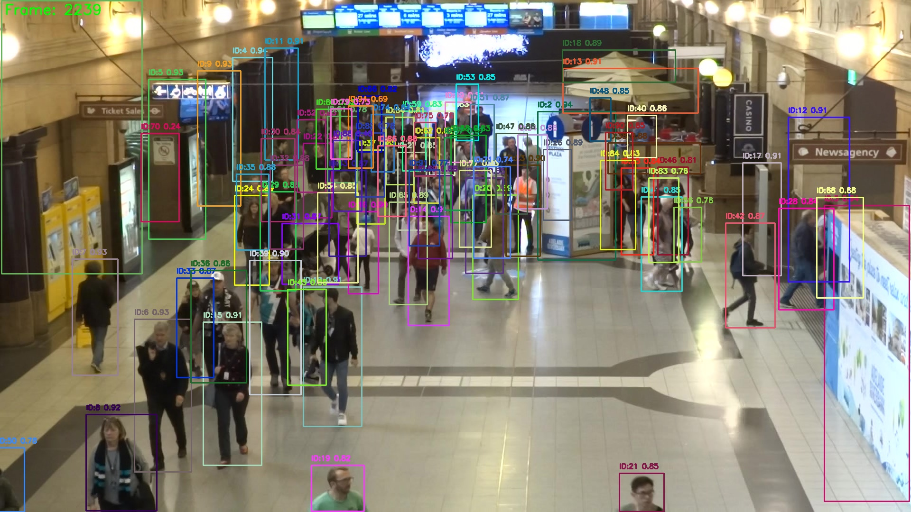
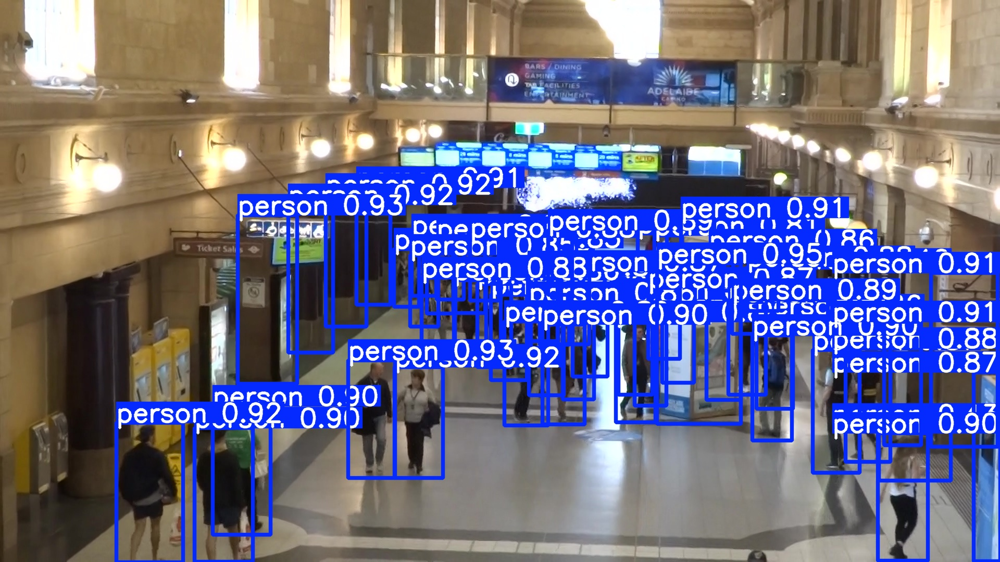

# Multi-Object Tracking (MOT) Project

This repository contains the implementation of a Multi-Object Tracking (MOT) pipeline using YOLOv8 and ByteTrack for pedestrian tracking in retail store surveillance videos. The project includes dataset preparation, training, validation, testing, and evaluation using traditional and HOTA metrics.

---

## Project Overview

The goal of this project is to detect and track pedestrians across video sequences from surveillance footage. The pipeline consists of:

- Dataset preparation and conversion to YOLO format
- Training a YOLOv8 object detector
- Tracking using ByteTrack tracker
- Validation and testing on MOTChallenge-like datasets
- Evaluation using traditional CLEAR metrics and advanced HOTA metrics
- Visualization of tracking results on video frames

## Dataset Preparation

The dataset consists of multiple sequences with pedestrian annotations in MOTChallenge format. The preparation script:

- Reads ground truth bounding boxes
- Converts annotations to YOLO format (normalized bounding boxes)
- Splits images and labels into training and validation sets (80/20 split)
- Creates a `data.yaml` file for YOLO training

Supported sequences: `02`, `03`, and `05`.

## Model Training and Testing

- YOLOv8 model is used for pedestrian detection.
- The best trained weights are loaded for testing on the test dataset.
- Detection results are saved with bounding boxes drawn on images.

## Tracking and Evaluation Pipeline

- The `MOTTracker` class integrates YOLOv8 detection and ByteTrack tracking.
- The pipeline processes validation and test sequences to generate tracking outputs.
- Results are saved in MOTChallenge format for evaluation.
- Traditional CLEAR metrics and HOTA metrics are computed.
- Plots of AssA vs DetA, AssPr vs AssRe, and DetPr vs DetRe are generated.

## Evaluation Tools

- The project uses the [TrackEval](https://github.com/JonathonLuiten/TrackEval) toolkit for evaluation.
- Evaluation includes HOTA, CLEAR, and Identity metrics for sequence `02`.

## Usage

Run the main tracking pipeline via:

```python
if __name__ == "__main__":
    submission, hota_results = run_tracking_pipeline()
```

This will process validation and test sequences, run evaluations, and generate submission files.

## Results Visualization

### Sample Tracking Results Images

| Sequence 1 Example | Sequence 2 Example | Test Prediction Example |
|:------------------:|:------------------:|:----------------------:|
|  |  |  |

### Tracking Videos

- [30 FPS Video](https://drive.google.com/file/d/1AEi_QZJP4BCUQNTsNGE4GfsvIeHxXh6g/view?usp=sharing)
- [60 FPS Video](https://drive.google.com/file/d/1jRoDEGrPzyqAm-li5Kb4R_ceY890QDCC/view?usp=sharing)

### GIF Previews


---

## Dependencies

- Python 3.7+
- OpenCV
- numpy
- pandas
- tqdm
- ultralytics (YOLOv8)
- TrackEval toolkit

## Notes

- Paths and configs are set for the Kaggle environment but can be adapted.
- Results and evaluation depend on proper dataset structure and ground truth availability.

---
